# 很多人没理解Multi Agent 的逻辑。

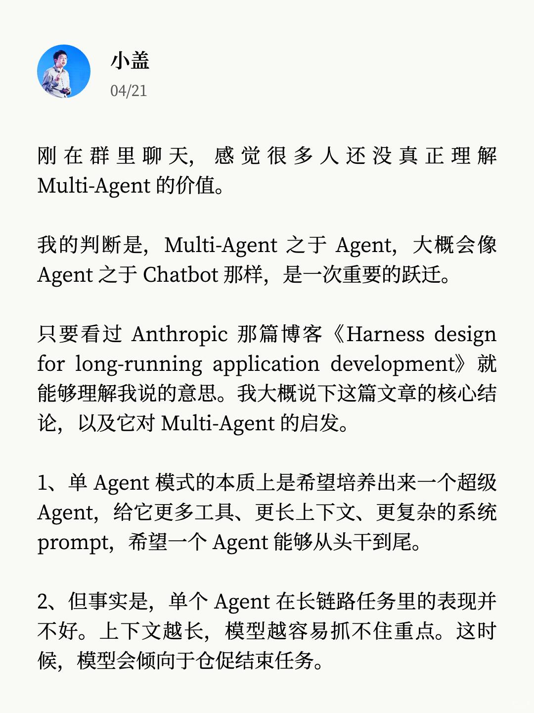

刚在群里聊天，感觉很多人还没真正理解 Multi-Agent 的价值。我的判断是，Multi-Agent 之于 Agent，大概会像 Agent 之于 Chatbot 那样，是一次重要的跃迁。
	
只要看过 Anthropic 那篇博客《Harness design for long-running application development》就能够理解我说的意思。我大概说下这篇文章的核心结论，以及它对 Multi‑Agent 的启发。
	
1、单 Agent 模式的本质上是希望培养出来一个超级 Agent，给它更多工具、更长上下文、更复杂的系统 prompt，希望一个 Agent 能够从头干到尾。
	
2、但事实是，单个 Agent 在长链路任务里的表现并不好。上下文越长，模型越容易抓不住重点。这时候，模型会倾向于仓促结束任务。
	
3、压缩上下文，或者结构化交接并不是最优的解决办法。因为长任务中有很多当时看着不重要，但却极其关键的细节。压缩和交接都会损失这些信息。
	
4、更有意思的是，像人一样，让同一个模型评审自己的设计或代码，它会自嗨，尤其是前端设计这种没有单测的主观任务。
	
5、Anthropic 做过一个实验，同样的模型，同样的任务，单 Agent 交付的结果看上去该有的功能都有，但效果很差。换成三角色的 Multi‑Agent 流水线去做，整体完成度明显高了一个水准。
	
看完这五条，其实结论就很清楚了。从 ChatBot 到 Agent，再到 Multi-Agent，这是 AI 发展的一条非常确定的路径。
	
昨天，Kimi 发布了 K2.6，最新的 SOTA 开源编程模型。从这次的更新 Blog 中，我感觉 Kimi 应该把 Multi-Agent 当成了一个重要的方向。这一点让我非常惊喜。他们推出了两个相关的功能：
	
1）Agent 集群
2）Claw 群组
	
这两个能力，其实分别对应目前行业里的两种 Agent 模式：一种是 Sub-Agent，一种是 Agent Team。
	
Sub-Agent 模式的核心，用一句话说，其实就是一个主 Agent 带一群临时工。主 Agent 接到任务，先拆解，然后按需召唤多个子 Agent 去并行处理每个子任务。
	
子 Agent 各干各的活，把结果交回主 Agent 汇总。任务一结束，子 Agent 就解散了。下次再有任务，重新召唤。

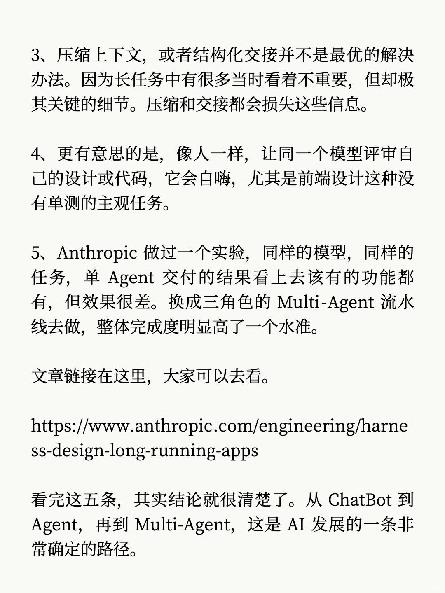
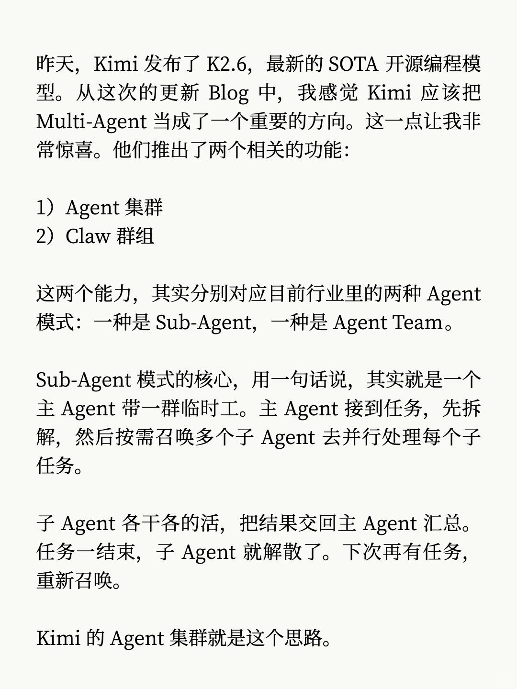
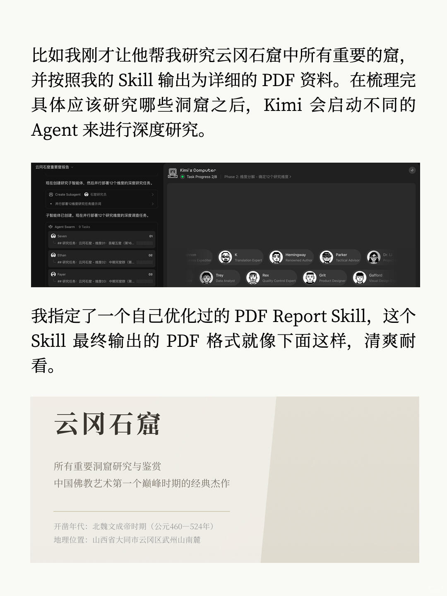
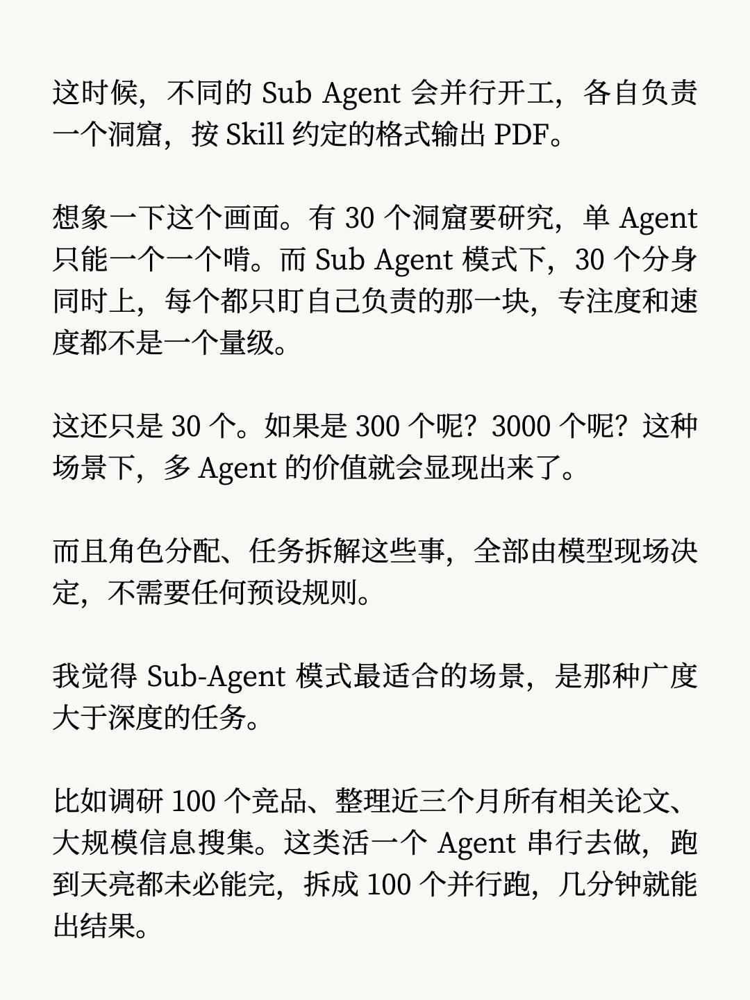
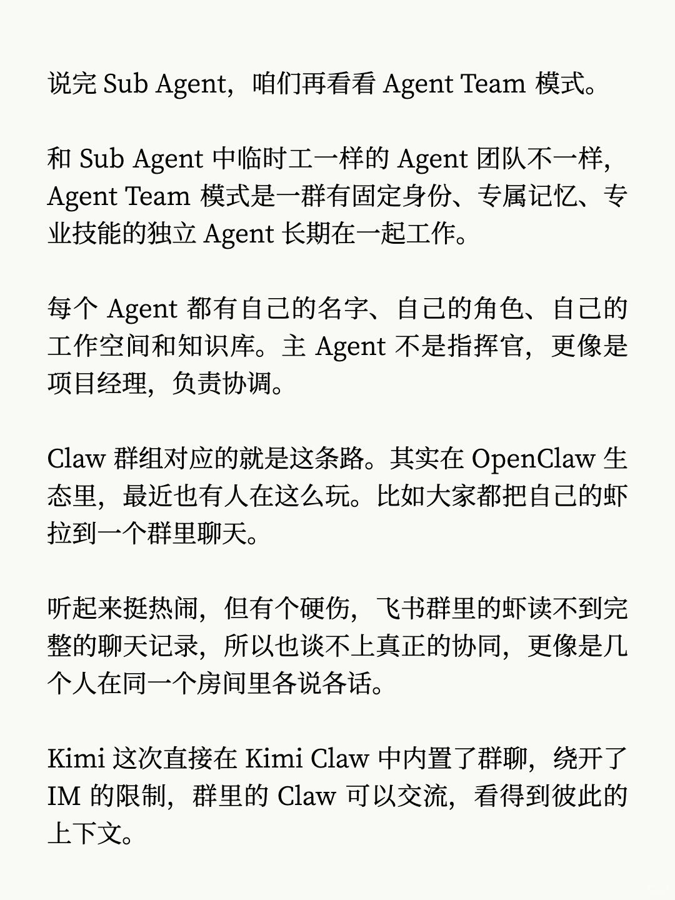
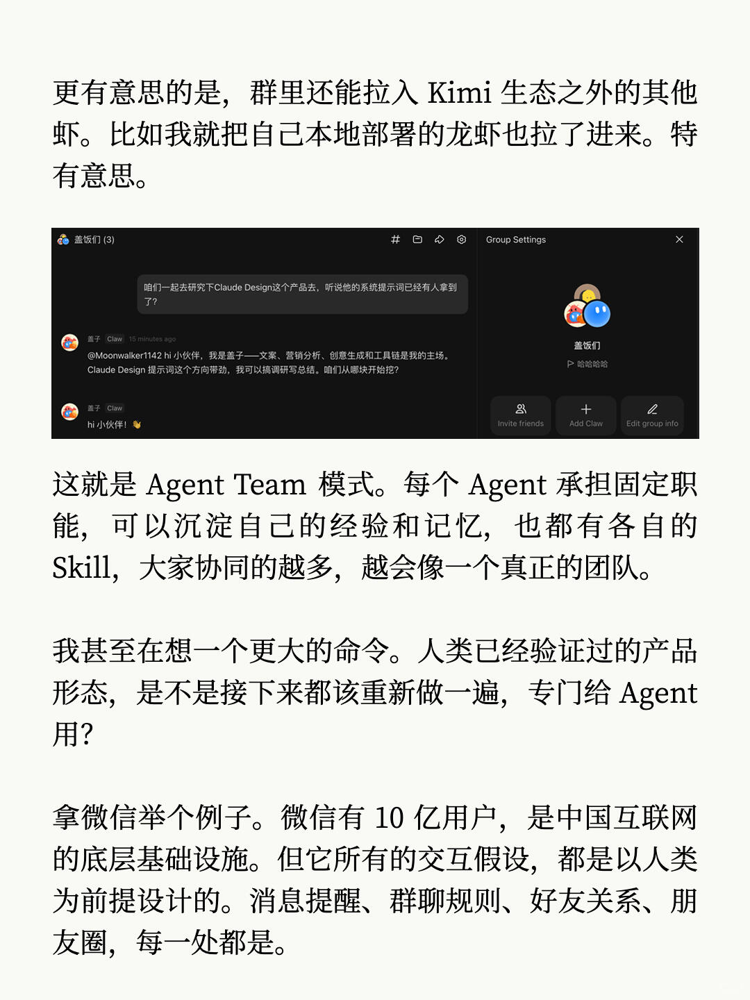
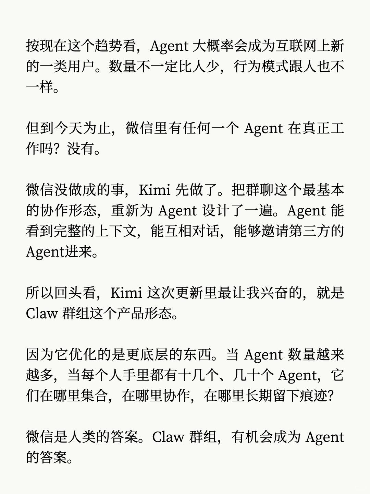
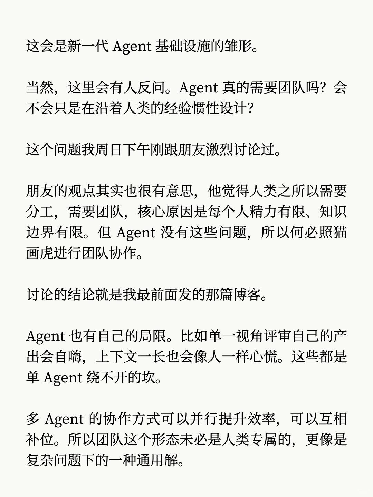
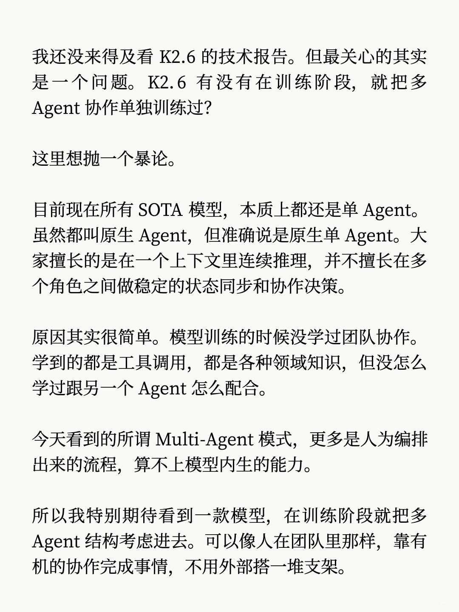
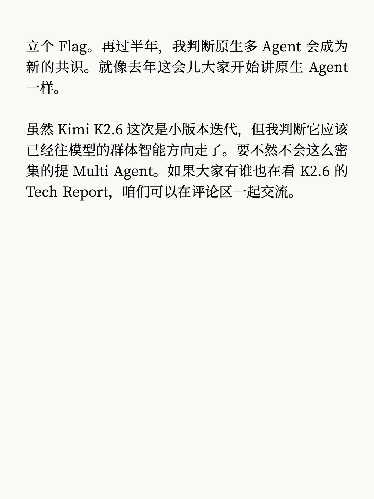
