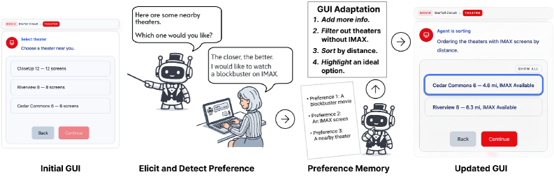

## 核心结论

MAESTRO 说明，Conversational Agent with GUI 的关键能力不应停在“把话转成界面动作”。在偏好驱动的多步骤任务里，agent 还应维护用户偏好、改变当前界面的信息呈现，并在发现偏好冲突时指导用户回到合适的前置阶段。

## 机制

MAESTRO 用 `Preference Memory` 抽取偏好及其强度，再驱动两个机制：

- `Preference-Grounded GUI Adaptation`：在既有 GUI 内执行 augment、sort、filter、highlight 等操作，帮助用户比较当前阶段选项。
- `Preference-Guided Workflow Navigation`：检测当前路径与用户偏好之间的冲突，建议具体回退位置，并记录 dead-end，避免重复失败。

这张图的知识点是：偏好记忆不是离线 profile，而是直接参与界面适配。用户提出 IMAX 和距离偏好后，系统筛选、排序并高亮影院选项，让偏好转化为可见的 GUI 变化。

## 证据与边界

论文在电影订票 CAG 中进行 N=33 的被试内实验，比较 Baseline 与 MAESTRO，并比较 Text 与 Voice。论文报告 MAESTRO 改善决策质量，并促进用户通过自然语言表达偏好；但语音交互也可能增加延迟和轮次负担。

当前页面依据 arXiv HTML 与摘要整理，未逐项复核统计细节，因此实验结论应保留为论文内报告。

## 与其他页面的关系

- 更新 [[GUI Agent]]：GUI agent 不只是执行动作，还可以支持 GUI 内决策。
- 更新 [[Mobile Agent Personalization]]：偏好记忆可以被用来实时改变界面和 workflow。
- 关联 [[Long-Horizon Agent Evaluation]]：多步骤流程的困难包括跨阶段偏好冲突和回退成本。

## 待确认问题

- 偏好强度在不同任务域是否稳定可迁移？
- GUI 原位适配的 operator 是否能覆盖更开放的界面结构？
- 回退建议的触发阈值如何避免打扰用户？

> 来源：[[../sources/arXiv/MAESTRO_ Adapting GUIs and Guiding Navigation with User Preferences in Conversational Agents with GUIs.md]]
