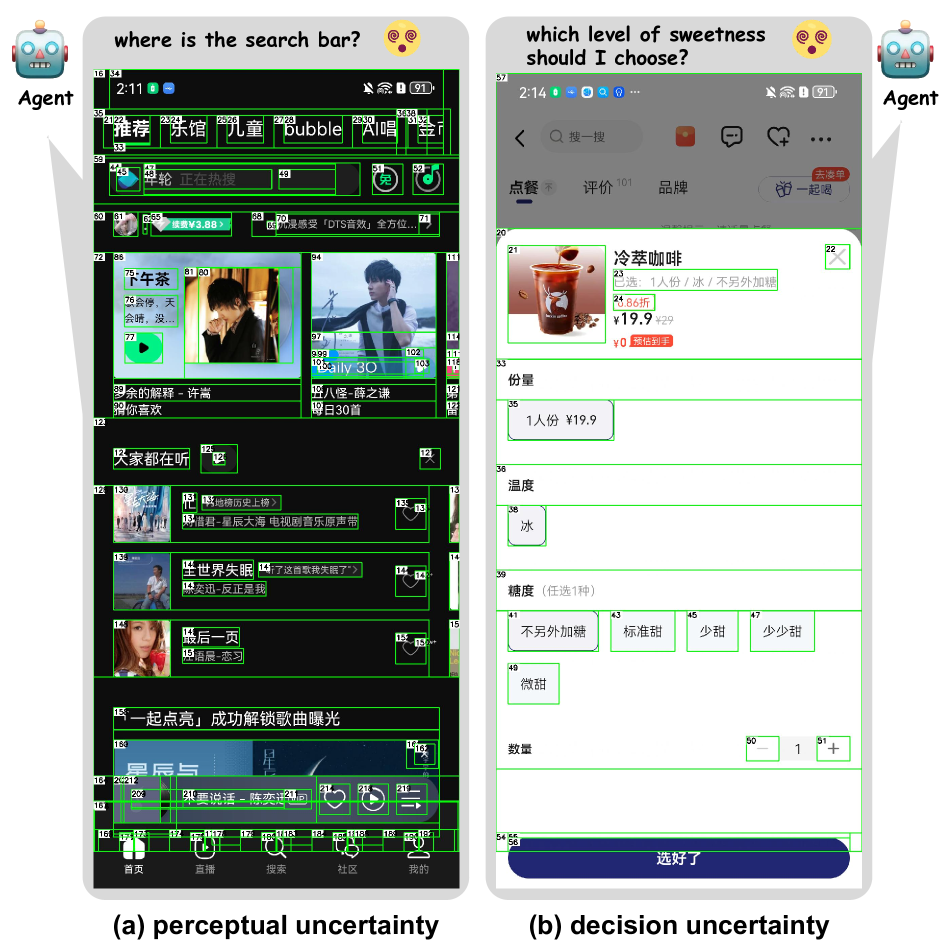

## 核心结论

RecAgent 的关键贡献是把 GUI agent 的不确定性拆成两类：屏幕元素冗余造成的感知不确定性，以及任务意图含糊造成的决策不确定性。前者用组件推荐降低输入复杂度，后者用人类在环反馈澄清。

## 机制

系统包含：

- `Component Recommendation Module`：筛选与任务相关的 UI 元素。
- `Decision Agent`：基于推荐组件选择动作。
- `Retrospection Mechanism`：动作失败后移除不合适候选并重新决策。
- `Interaction Agent`：在高决策不确定性时询问用户。
- `Memory Unit`：记录子目标、动作、反馈和摘要。

该图的知识点是：RecAgent 不是让决策器处理完整屏幕，而是在决策前做候选组件压缩，并在必要时把含糊意图交还给用户确认。

## 证据与边界

论文报告，在 AndroidWorld 消融中，Component Recommendation Module 和 Retrospection Mechanism 组合达到 47.8% 成功率；在 ComplexAction 中，三种推荐路径组合达到 69.3%。ComplexAction 用复杂移动 GUI 场景评估指定单步动作是否能正确执行。

边界是：当前页面未核验代码仓库、数据集规模和标注协议。ComplexAction 更适合诊断单步 grounding 与感知冗余，不等同于完整长程任务能力。

## 与其他页面的关系

- [[GUI Agent]]：补充“感知过滤”作为 GUI agent 的独立设计轴。
- [[Agent Reflection]]：retrospection 是局部候选修正，粒度小于 MobileUse 的轨迹和全局反思。
- [[Long-Horizon Agent Evaluation]]：单步复杂动作 benchmark 可帮助拆解长程失败的底层原因。

## 待确认问题

- 组件推荐一旦漏掉目标元素，后续模块如何恢复？
- 用户澄清触发阈值如何平衡成功率和打扰成本？
- ComplexAction 是否能泛化到更多语言、app 类型和动态页面？

> 来源：[[../sources/arXiv/Uncertainty-Aware GUI Agent_ Adaptive Perception through Component Recommendation and Human-in-the-Loop Refinement.md]]
